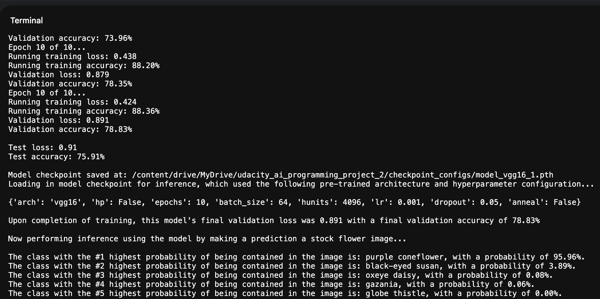

# Udacity Nanodegree: AI Programming with Python, Project 2: Flower Image Classifier

## Objective

Using a pretrained model architecture, train, validate, test, and perform inference using an image classification model, with respect to 102 classes of flower types. The minimum validation and testing accuracy to be achieved is 70%.

## Getting Started

### Prerequisites

#### Part 1 - Development Notebook
- Google Colab or Jupyter-like environment with Jupyter Notebook
- Python 3.12.12+
- PyTorch 2.9+
- CUDA (Note: T4/A100 GPUs recommended.)

#### Part 2 - Command Line Application
- Python 3.12.12+
- PyTorch 2.9+
- CUDA (Note: T4/A100 GPUs recommended.)

## Installation

1) Unzip the 'udacity_ai_programming_project_2.zip' file into a desired working directory/cloud storage like Google Drive.

## Datasets

- Located at the following link: [Flower Data](https://s3.amazonaws.com/content.udacity-data.com/nd089/flower_data.tar.gz)

## Model Architecture

### Part 1 - Development Notebook
- The following pretrained CNN-based architectures are available: VGG16_BN, VGG19_BN. Upon freezing the CNN weights of the architecture, a custom 'Classifier' is connected to the pre-trained model for training.

### Part 2 - Command Line Application
- The following pretrained CNN-based architectures are available: VGG16_BN, VGG19_BN, RESNET50. Upon freezing the CNN weights of the architecture, a custom 'Classifier' is connected to the pre-trained model for training.

## Model Results

- Hyperparameter tuning was performed to prune and obtain optimal hyperparameters. The following frameworks were utilized, available via pip installation: RayTune, ASHAScheduler.
- Results for both 'Part 1' and 'Part 2' are identical, where using the optimal hyperparameter configuration and architecture, final validation accuracy and test accuracy approximately fall in the range of 73-82%.
    - Part 1, all outputs of the 'image_classifier_project_part_1.html' converted notebook-to-HTML file are kept from the final run before submission.
    - Part 2, the following is a captured image of the the output of the final training epoch, the checkpoint location and details, the final validation and test metrics of the model, and the top-k (default is 5) most probable classes with probabilities based on inference of the stock image stored at './istockphoto-1273007054-612x612.jpg':



## Part 1 - Development Notebook

### Instructions
(Note: These are instructions for executing the program written in 'image_classifier_project_part_1.ipynb,' the development notebook completed for part 1. I provided the notebook version of the final HTML file 'image_classifier_project_part_1.html' as a Jupyter Notebook, 'image_classifier_project_part_1.ipynb' in the project directory, in case the development notebook needs to be ran.)
1) Within the directory './udacity_ai_programming_project_2', open the file 'image_classifier_project_part_1.ipynb' in a Jupyter-like environment.
    - If executing the program in a non-local Google Colab environment, and the project is stored on a Google Drive: Please uncomment and run the very first code cell in the notebook, which will mount your Google Drive and then change the working directory to the project itself; this ensures all in-code dependencies for project directory access function properly.
    - If executing the program in a non-local Google Colab environment, and the project is stored locally: Please uncomment and run the second code cell in the notebook, which will change the working directory from the Colab instance storage to the project directory it contains; this ensures all in-code dependencies for project directory access function properly.
3) Connect to the CUDA GPU.
4) If the option is available in the used environment, run all cells; else, run each cell in order.
5) The 'main' cell from which the program will be executed is the second-to-last code cell in the notebook; all applicable project part 1 results will be displayed upon running this cell.
   - The hyperparameters already defined in the 'Global Hyperparameter Variables' section are what were found to be most optimal for implementation. For brevity, this notebook assumes the use of the VGG16 or VGG19 architectures. Therefore, please only choose between 'vgg16' and 'vgg19' when updating the 'arch' dictionary value in the 'hyperparameters' dictionary. (Note: The VGG architectures, as well as Resnet50, will be available as pretraining options in the command line application in part 2.)
6) Within the project results displayed in Step 4, there is a statement that will affirm that the model checkpoint has been saved to a .pth file in the './udacity_ai_programming_project_2/checkpoint_configs' directory; additionally, details stored in the checkpoint are displayed immediately after. Navigate to that directory to confirm the model has been saved to a .pth file, with a name of the form 'model_{architecture}_{count}.pth', where the 'architecture' is the pretrained architecture used for model training, and the 'count' is the cumulative count on which this architecture has been used for configuration during a given runtime.
7) (Only when using a Google Colab environment with a mounted Google Drive) Before disconnecting from runtime, please uncomment and run the final code cell in the notebook; this ensures that all files on Colab's instance storage (most crucially, it will force Colab to write the .pth model checkpoint files, so they are saved persistently in the user's Google Drive).

## Part 2 - Command Line Application

### Project Directory Files
- 'train.py': where the program is executed from.
- 'predict.py': contains helper functions called from 'train.py', for model inference.
- 'classifier.py': contains the definition for the custom model classifier to be connected to the pretrained architecture.
- 'image_classifier_functions.py': contains helper functions called from 'train.py', for model training.
- 'config.py': used for hyperparameter tuning, contains class definitions for ASHA Scheduling and Ray Tuning, as well as attributes that define hyperparameter spaces, and training functions that the Ray Tuner uses to fit and report using the hyperparameter spaces iteratively. (Note: This .py file is compiled, but not run, if not hyperparameter tuning. Hyperparameter tuning is only executed when the '--hp' flag is included in the CLI command input in Step 2 of 'Instructions.' That is to say, this file does not have any bearing on the project results or criterion, and can be ignored for grading.)

### Instructions
1) Open a command line interface, and change directory to where the project is stored (project directory: './udacity_ai_programming_project_2').
2) Input the following command into the CLI, which will run the 'train.py' script (the 'main' program functionality), as well as utilize the optimal pretrained architecture and hyperparameter configuration for project implementation. All applicable project part 2 results will be displayed as the program is executed:

`python train.py --arch vgg16 --epochs 10 --batch_size 64 --hunits 4096 --lr 0.001 --dropout 0.05`

3) Within the project results displayed in Step 2, there is a statement that will affirm that the model checkpoint has been saved to a .pth file in the './udacity_ai_programming_project_2/checkpoint_configs' directory; additionally, details stored in the checkpoint are displayed immediately after. Navigate to that directory to confirm the model has been saved to a .pth file, with a name of the form 'model_{architecture}_{count}.pth', where the 'architecture' is the pretrained architecture used for model training, and the 'count' is the cumulative count on which this architecture has been used for configuration during a given runtime.

## Author

Kevin Howard, Udacity/Woolf College Student, M.S. Artificial Intelligence


```python

```
